# 🎨 Composed Image Retrieval System - Complete Flowchart

## 📋 System Overview Flowchart

```mermaid
flowchart TD
    A[👤 User Uploads Image + Text] --> B[🌐 Frontend Interface]
    B --> C[📡 POST /retrieve API Call]
    C --> D[🔧 API Service Initialization]
    
    D --> E[📥 Request Processing]
    E --> F[🖼️ Image Decoding & Preprocessing]
    E --> G[📝 Text Analysis]
    
    F --> H[🧠 CLIP Image Feature Extraction]
    G --> I[🧠 CLIP Text Feature Extraction]
    
    H --> J[🔗 Feature Fusion with Combiner Network]
    I --> J
    
    J --> K[🎨 Color Analysis from Text]
    K --> L{Color Detected?}
    
    L -->|Yes| M[🎯 Color Pre-filtering]
    L -->|No| N[📊 Category Selection]
    
    M --> N
    
    N --> O{Multiple Categories?}
    
    O -->|Single| P[📁 Use Category-Specific Index]
    O -->|Multiple| Q[🔗 Build Combined Index]
    
    P --> R[🔍 Similarity Search with HNSW]
    Q --> R
    
    R --> S[📈 Result Ranking & Filtering]
    S --> T[📋 Result Preparation]
    T --> U[📤 JSON Response to Frontend]
    U --> V[🖼️ Image Display to User]
    
    style A fill:#e1f5fe
    style V fill:#e8f5e8
    style J fill:#fff3e0
    style M fill:#f3e5f5
    style R fill:#e0f2f1
```

## 🔧 Detailed Processing Flowchart

```mermaid
flowchart TD
    A[📥 API Request Received] --> B[🔍 Parse Request Data]
    B --> C[🖼️ Decode Base64 Image]
    B --> D[📝 Extract Modification Text]
    B --> E[🏷️ Get Search Categories]
    
    C --> F[🔄 Convert to PIL Image]
    F --> G[⚙️ CLIP Preprocessing]
    G --> H[🧠 CLIP Image Encoding]
    H --> I[📊 640-dim Image Features]
    
    D --> J[🔤 CLIP Tokenization]
    J --> K[🧠 CLIP Text Encoding]
    K --> L[📊 512-dim Text Features]
    
    I --> M[🔗 Combiner Network]
    L --> M
    M --> N[📊 640-dim Joint Features]
    
    D --> O[🎨 Color Text Analysis]
    O --> P{Color Pattern Match?}
    
    P -->|Yes| Q[🎯 Extract Target Color]
    P -->|No| R[❌ No Color Filtering]
    
    Q --> S[📏 Calculate Color Radius]
    S --> T[🔍 Find Nearest Color Cluster]
    T --> U[🎯 Query Color KD-Tree]
    U --> V[📋 Get Color-Filtered Image IDs]
    
    E --> W[🏷️ Determine Search Categories]
    W --> X{Category Count?}
    
    X -->|Single| Y[📁 Use Pre-built Category Index]
    X -->|Multiple| Z[🔗 Combine Category Indices]
    
    Y --> AA[🔍 HNSW Similarity Search]
    Z --> AA
    
    AA --> BB[📈 Get Top 100 Candidates]
    BB --> CC{Color Filter Active?}
    
    CC -->|Yes| DD[🎯 Apply Color Filter to Results]
    CC -->|No| EE[📊 Use All Results]
    
    DD --> FF[📋 Select Top 20 Color Matches]
    EE --> GG[📋 Select Top 20 Overall]
    
    FF --> HH[📝 Prepare Result Objects]
    GG --> HH
    
    HH --> II[🖼️ Add Image Paths]
    II --> JJ[🎨 Add Color Metadata]
    JJ --> KK[📊 Add Similarity Scores]
    KK --> LL[📤 Send JSON Response]
    
    style A fill:#e3f2fd
    style LL fill:#e8f5e8
    style M fill:#fff3e0
    style V fill:#f3e5f5
    style AA fill:#e0f2f1
```

## 🎨 Color Processing Flowchart

```mermaid
flowchart TD
    A[📝 Text Input] --> B[🔤 Convert to Lowercase]
    B --> C[🔍 Exact Color Match]
    
    C --> D{Exact Match Found?}
    D -->|Yes| E[🎯 Return Exact Color]
    D -->|No| F[🔍 Pattern Matching]
    
    F --> G[📋 Check Color Patterns]
    G --> H[🔍 Regex Patterns]
    
    H --> I{Pattern Match?}
    I -->|Yes| J[🎨 Extract Color Pair]
    I -->|No| K[🔍 Color Keywords]
    
    J --> L[🎯 Lookup Both Colors]
    L --> M{Both Colors Found?}
    M -->|Yes| N[🔄 Blend Colors]
    M -->|No| O[❌ No Color Match]
    
    N --> P[📊 Calculate Average RGB]
    P --> Q[🎯 Return Blended Color]
    
    K --> R{Color Keywords Found?}
    R -->|Yes| S[🎯 Return Neutral Color]
    R -->|No| T[❌ No Color Detected]
    
    E --> U[📏 Determine Color Radius]
    Q --> U
    S --> U
    
    U --> V{Query Type?}
    V -->|Combination| W[📏 Radius = 100]
    V -->|Light/Dark| X[📏 Radius = 80]
    V -->|Exact| Y[📏 Radius = 60]
    
    W --> Z[🔍 Color Clustering Search]
    X --> Z
    Y --> Z
    
    Z --> AA[🎯 Find Nearest Cluster]
    AA --> BB[🔍 Query Within Radius]
    BB --> CC[📋 Get Filtered Image IDs]
    
    style A fill:#e1f5fe
    style CC fill:#e8f5e8
    style N fill:#fff3e0
    style Z fill:#f3e5f5
```

## 🏗️ System Architecture Flowchart

```mermaid
flowchart TD
    A[🚀 System Startup] --> B[📚 Load CLIP Model]
    A --> C[🔗 Load Combiner Model]
    A --> D[📁 Load Category Data]
    
    B --> E[🧠 CLIP RN50x4 Model]
    C --> F[🔗 AttentionFusionCombiner]
    
    D --> G[📊 Load Dress Data]
    D --> H[📊 Load Shirt Data]
    D --> I[📊 Load TopTee Data]
    
    G --> J[🔍 Build Dress Index]
    H --> K[🔍 Build Shirt Index]
    I --> L[🔍 Build TopTee Index]
    
    J --> M[📁 Category Indices]
    K --> M
    L --> M
    
    G --> N[🎨 Extract Color Data]
    H --> N
    I --> N
    
    N --> O[🔍 K-Means Color Clustering]
    O --> P[🌳 Build Color KD-Trees]
    P --> Q[📋 Color Metadata]
    
    E --> R[🔧 Model Pool]
    F --> R
    M --> S[📊 Index Pool]
    Q --> T[🎨 Color Pool]
    
    R --> U[🔄 Request Processing]
    S --> U
    T --> U
    
    U --> V[📤 Response Generation]
    
    style A fill:#e3f2fd
    style V fill:#e8f5e8
    style R fill:#fff3e0
    style S fill:#f3e5f5
    style T fill:#e0f2f1
```

## 📊 Data Flow Diagram

```mermaid
flowchart LR
    A[👤 User] --> B[🌐 Frontend]
    B --> C[📡 Flask API]
    
    C --> D[🧠 CLIP Model]
    C --> E[🔗 Combiner Model]
    C --> F[📊 HNSW Indices]
    C --> G[🎨 Color Clusters]
    
    D --> H[📊 Image Features]
    D --> I[📊 Text Features]
    
    H --> J[🔗 Feature Fusion]
    I --> J
    
    J --> K[🔍 Similarity Search]
    F --> K
    
    K --> L[🎯 Color Filtering]
    G --> L
    
    L --> M[📋 Results]
    M --> C
    C --> B
    B --> A
    
    style A fill:#e1f5fe
    style M fill:#e8f5e8
    style J fill:#fff3e0
    style L fill:#f3e5f5
    style K fill:#e0f2f1
```

## 🔄 Request-Response Cycle

## 📈 Performance Metrics

- **Total Images**: 37,189 unique images
- **Categories**: Dress (11,643), Shirt (13,261), TopTee (12,945)
- **Feature Dimensions**: Image (640), Text (512), Joint (640)
- **Search Speed**: 100-500ms per query
- **Color Support**: 80+ colors and combinations
- **Result Quality**: Top 20 most similar with color filtering

## 🎯 Key Components

1. **CLIP Model**: Vision-language feature extraction
2. **Combiner Network**: Feature fusion with attention mechanism
3. **HNSW Indices**: Fast similarity search per category
4. **Color Clustering**: K-means + KD-trees for color filtering
5. **Flask API**: RESTful service with CORS support
6. **Frontend**: HTML/JS interface for user interaction

This flowchart shows the complete end-to-end process of how your composed image retrieval system works! 🎨✨ 